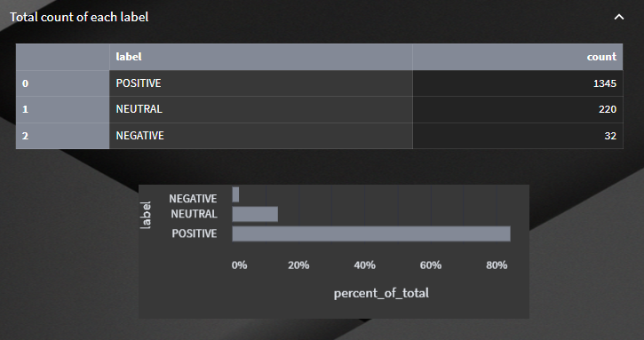

# SENTIMENT ANALYSIS - STREAMLIT APPS

A project of sentiment analysis applications in various fields, such as product overview, social media analysis, political sentiment, employee feedback, and healthcare analysis, with several options of pretrained models such as TextBlob, Vader and Pattern. 

&nbsp;

### DESCRIPTION OF UPLOADED FILES

### "code" folder

- contained all the codes, dataset, and some images for streamlit app design

|File Name|Description|
|---------|-----------|
|bg6-resized.png|Streamlit App's background image|
|employee-feedback.csv|The employee feedback dataset|
|heathcare-depression.csv|The healthcare feedback dataset|
|info.py|The class contained all the descriptions that will displayed on streamlit app|
|logo.png|The smile image used in sidebar|
|main.py|The main code of this project (all in one file)|
|models.py|The class contained all the sentiment analysis pretrained models|
|politic-uk.csv|The political comments dataset|
|product-reviews.csv|The product reviews dataset|
|requirements.txt|The python packages required to run the streamlit app|
|socmed-tweets.csv|The social media comments dataset|
|wordcloud-shape.png|The wordcloud background shape|

### "results" folder

- contained only the screenshot of each page created 

&nbsp;

### THE APP

- this is the preview of the sentiment analysis streamlit apps created, you may refer to "results" folder for more. 

&nbsp;

Thank you for reading my work!!! I appreciate your time and attention.
